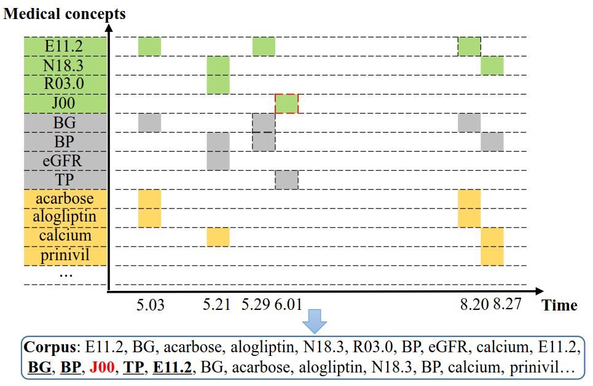
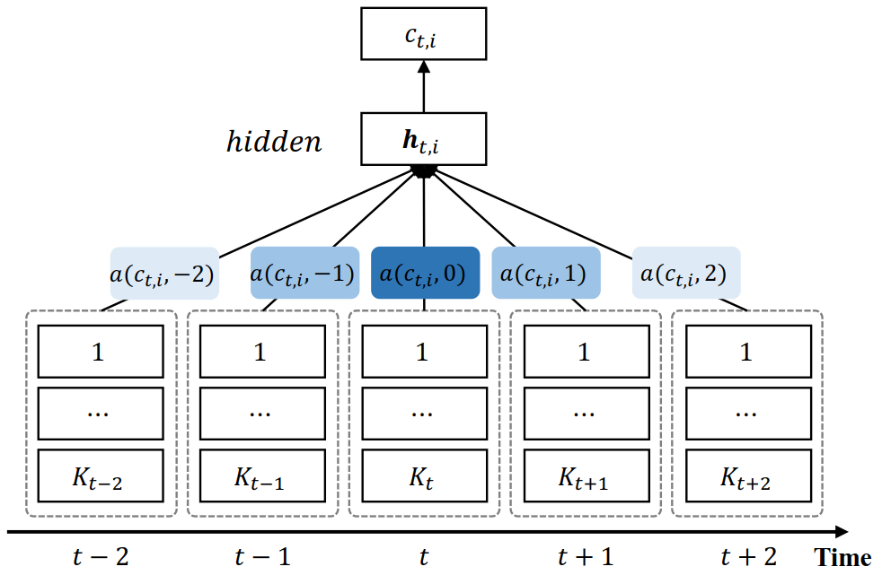

# Medical Concept Embedding

*update 2018-08-21*
## Data Link

The link to DE-SynPUF dataset is "https://www.google.com.hk/search?q=DEsynpuf+cms+dataaset&oq=DEsynpuf+cms+dataaset&aqs=chrome..69i57j33l3.6992j1j7&sourceid=chrome&ie=UTF-8".

## Introduction

This repository is an implementation introduce in the following paper. The draft version can be found at https://arxiv.org/pdf/1806.02873.pdf.

    Medical Concept Embedding with Time-Aware Attention
    Xiangrui Cai, Jinyang Gao, Kee Yuan Ngiam, Beng Chin Ooi, Ying Zhang, Xiaojie Yuan
    IJCAI 2018 (To appear)

Medical concept embedding is central to healthcare analysis on the structured Electronic Medical Records (EMRs), which represents the medical concepts by low-dimensional continuous vectors. The vectors not only benefit the performance of downstream application, but also enable knowledge base construction in healthcare domain. 

Unfortunately, current methods for medical concept embedding ignore two important factors in EMRs:

* __Time lag__: 2 consecutive medical concepts may be not temporal close.
* __Various temporal scopes__: temporal scopes of medical concepts often varies a lot, e.g., common cold and diabetes.

Our method, MCE, is proposed to address the problems above. MCE employs a time-aware attention to model the influence of the target medical concept on a series of time periods around it. As shown in the following figure, the model is built based on CBOW and 
the darker cells indicate heavier influence of the target on the corresponding time unit.

## Implementation

This implementation is based on the [FastText toolkit](https://github.com/facebookresearch/fastText). However, the input of EMR data is quite different from free text, please refer to the rest for the details.

## Run MCE

### Step 1: Build

The implementation uses c++11 features, it requires a compiler with c++ support, such as `gcc-4.6.3` or newer.

After clone the repository, one can easily compile it by `make`.

    git clone https://github.com/XiangruiCAI/mce
    cd mce
    make

Then the `mce` under the folder is the executable file.

### Step 2: Data preparation

The input format of a EMR dataset to this project is a single text file, where each line contains a sequence of records of a patient. Specifically, each line should follow the format:

    patient_id, [[timestamp_1, [concept_id_1, concept_id_2, ..., concept_id_K1]], [timestamp_2, [concept_id_1, concept_id_2, ..., concept_id_K2]], ...]

patient_id is an integer, timestamp is the unix time stamp and concept_id is also integer. The list is sorted by the timestamp.
For example, `1, [[1353050220.0, [1,2,3,4]], [1353050241.0,  [3,4,5,6]], 1353054300.0, [1,7,8,9,10,16,17]]` represents that the EMR sequence of patient1 contains 3 subset at 3 timestamps (by seconds) and each subset has several medical concepts. We will refer to this file as "EMR file" later.

### Step 3: Run mce

Users can run the MCE model with the following example command:

    ./mce attn2 -input path/to/EMR/file -output result/file -epoch 10 -thread 16 -neg 5 -t 1e-4 -dim 100 -lr 0.01 -ws 30 -attnws 20

After training, the medical concept embeddings are saved in the result file. All arguments of this model are listed below

    The following arguments are mandatory:
      -input              training file path
      -output             output file path

    The following arguments are optional:
      -lr                 learning rate [0.05]
      -lrUpdateRate       change the rate of updates for the learning rate [100]
      -dim                size of word vectors [100]
      -ws                 size of the context window [5]
      -attnws             size of the attention window [10]
      -epoch              number of epochs [5]
      -minCount           minimal number of word occurences [5]
      -neg                number of negatives sampled [5]
      -wordNgrams         max length of word ngram [1]
      -thread             number of threads [12]
      -t                  sampling threshold [0.0001]
      -timeUnit           unit of time scope [3]
      -verbose            verbosity level [2]
